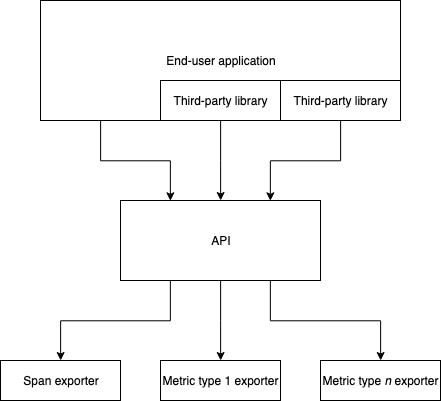

# Implement SDK as an exporter

Invert the exporter and SDK architecture such that the SDK becomes an exporter itself

## Motivation

This RFC addresses two main concerns:

1. Prevent the need to reimplement core code in order to use OpenTelemtry without the full SDK
1. Enable the API to provide concrete types for improved usability

## Explanation

This RFC proposes that the OpenTelemetry API follow the following architecture:



This is a substantial departure from the [current architecture](https://github.com/open-telemetry/opentelemetry-specification/blob/893a1dc621798cfc301f05bfb46cc0786332050a/specification/language-library-design.png). In particular:

* The API adopts a concrete implementation, rather than an abstract interface with different implementations including the SDK, a minimimal implementation, vendor-specific implementations, etc.
* The API sends data **directly** to exporters, rather than the SDK sending data to exporters
* The API **does not directly manage any state**

**Exporters** are then proposed as follows:

* Specific to a particular data type, e.g., `SpanExporter`, `MeasureExporter`
* Default to no-op behaviour; i.e., if the user does not provide an exporter for a particular data type, nothing should hold onto the data once it has been exported
  * The particular implementation of this may be language-specific, e.g., [null object pattern](https://en.wikipedia.org/wiki/Null_object_pattern) vs an optional object
* **Composable**

For example, the API may export spans through a `SpanExporter` such as:

```go
type SpanExporter interface {
	ExportSpan(Span)
}
```

A `FileSpanExporter` could then be implemented on top of a common, "building-block" `NonBlockingSpanExporter` as follows:

```go
type NonBlockingSpanExporter struct {
	lock     *sync.RWMutex
	exporter SpanExporter
}

func NewNonBlockingSpanExporter(wrappedExporter SpanExporter) NonBlockingSpanExporter {
	return NonBlockingSpanExporter{
		lock:     &sync.RWMutex{},
		exporter: wrappedExporter,
	}
}

func (e NonBlockingSpanExporter) ExportSpan(span Span) {
	e.lock.RLock()

	go func() {
		e.exporter.ExportSpan(span)

		e.lock.RUnlock()
	}()
}

func (e *NonBlockingSpanExporter) Close(ctx context.Context) error {
	e.lock.Lock()
	defer e.lock.Unlock()

	e.exporter = NoopSpanExporter{}

	return nil
}

type FileExporter struct {
	exporter trace.NonBlockingSpanExporter
}

func NewFileExporter(opts ...Option) FileExporter {
	c := newConfig(opts...)
	e := exporter{
		encoder:      json.NewEncoder(c.file),
		errorHandler: c.errorHandler,
	}

	return FileExporter{
		exporter: trace.NewNonBlockingSpanExporter(e),
	}
}

func (e FileExporter) ExportSpan(span trace.Span) {
	e.exporter.ExportSpan(span)
}

func (e FileExporter) Close(ctx context.Context) error {
	return e.exporter.Close(ctx)
}

type exporter struct {
	// internals
}

func (e exporter) ExportSpan(span trace.Span) {
	// write span to a file
}
```

In particular, the SDK itself becomes an exporter. Please see the section on [SDK implementation](#sdk-implementation) for more.

## Internal details

### API implementation

This RFC proposes that the API implementation should be both **concrete** and (effectively) **stateless**. What does this actually entail?

* The API should ensure some basic, cross-vendor state can be attached to spans without user intervention, e.g., `traceID`, `spanID`, `parentID`, `startTime`, `finishTime`
* The API should allow the end user to attach certain additional data to a span, e.g., logs, tags or attributes, etc.
  * This RFC intentional is intentionally unopinionated about what this data entails
* Any vendor-specific state may be supplied by exporters
* The API should not explicitly track any state independent of what is tracked, or held onto, by application code
  * e.g., in Go, an active span may be stored on a `context.Context` and sent to a `SpanExporter` when the user finishes it
    * If the `context.Context` goes out of scope without the user finishing the span, the span will be "lost" and will be garbage collected alongside the `context.Context` itself
    * It is up to the `SpanExporter` chosen by the user to manage the span once it has been exported

### Data type-specific exporters

Each "data type" - e.g., span or particular metric type - should have a corresponding exporter type.

Particular exporter _implementations_ may support exporting multiple data types, but are not required to. For exporters that support multiple types, end users must still be able to opt into using the exporter for only a subset of supported types. For example, if an exporter supports both spans and measures, a user should be able to use the exporter for spans but not for measures (or for measures but not spans).

This allowance for data type-specific exporters is significant for multiple reasons:

* Facilitates forward compatibility: as new data types get added, existing exporters will stay usable out of the box
* Allows users to use completely different exporters for different purposes, e.g., Jaeger for spans and Prometheus for metrics

### Default exporter functionality

Out of the box, default exporter functionality should be equivalent to immediately throwing out whatever data is exported. This may be implemented through some sort of no-op exporter or through an "optional" exporter, depending on what is most appropriate for the particular language.

In particular, the default behaviour **must**:

* Be lightweight, i.e., have minimal memory and CPU overhead
* Not error due to the absence of a user-provided exporter

### Composable exporters

While some exporters should be "end" exporters - e.g., sending data across the network - others are intended to be composable such that they may be reused by different "end" exporters.

For example, functionality for **batching** data could be implemented as a reusable exporter.

#### SDK implementation

Under the proposed architecture, the SDK itself would be implemented as an "end" exporter built upon a series of "composable" exporters. It would support exporting all of the exportable data types.

In particular, functionality for batching, limiting the number of attributes per span, etc. would be implemented through composable exporters which are then used internally by the SDK exporter.

## Trade-offs and mitigations

### "Closed" vs "transformative" exporters

As currently proposed, all exporters are treated equally - whether they are composable or not.

If this is too confusing, we could explicitly redefine those exporters that are composable as `Transformers`.

### Vendor-specific needs

Most vendor-specific requirements should be addressable through either exporters or by extending the core API, depending on the particular requirement and whether it needs user "intervention" or not. For instance, adding another ID to every span could be done through a transformative exporter, whereas allowing users to add logs to spans must be done through the API itself.

Additional exporters for certain "events" (e.g., creating a span; finishing a span) and/or callbacks for those same event types could also be provided.

## Prior art and alternatives

The three main prior art examples are OpenTracing, OpenCensus, and the existing OpenTelemetry architecture.

**OpenTracing** handles export functionality by having each vendor (or other party) reimplement the whole API. While this maximizes flexibility for vendors, it also means that everyone must redo a lot of the same logic - even if it's vendor-agnostic.

**OpenCensus** handles it by having a single implementation which then sends data to tracing and stats exporters. The implementation is itself opinionated and sometimes stateful.

The **existing OpenTelemetry architecture** essentially combines the OpenTracing and OpenCensus approaches. As with OpenTracing, the core API is itself an interface that can have different implementations. The OpenCensus "opinionated implementation" is then implemented as a _particular_ implementation (the "SDK"), which in turn supports exporters.

## Open questions

* Does this approach actually satisfy user concerns?
* Is this approach sufficient for all vendors' needs?
* Should all exporters be treated equivalently regardless of purpose, or should they split up into (for example) "exporters" and "transformers"?

## Future possibilities

* Event exporting and/or callbacks, e.g., for starting or finishing spans
* More decoupling of functionality from the SDK
* List and implementation of "standard" transformative exporters
